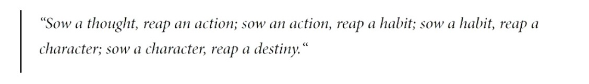

<!-- Calm Header Banner -->

# ʜɪ, ɪ'ᴍ ᴋʀᴀɴᴛʜɪ 👋

Engineer interested in **systems, reliability, and thoughtful automation**.

I enjoy understanding how complex systems behave, debugging the unexpected, and building tools that make operations simpler and more reliable.

## 💼 Experience

&nbsp;&nbsp;

&nbsp;&nbsp;

Building and operating **cloud infrastructure, distributed systems, and large-scale databases**.

## 🛠 Tools & Technologies

## ⚙️ What I Enjoy Building

- Automation tools that reduce operational overhead  
- Observability dashboards for system visibility  
- Cloud-native workflows and serverless applications  
- Reliable distributed systems

## 🌐 Elsewhere

Website → https://kranthikiran.com  
LinkedIn → https://linkedin.com/in/akkiran003/

---

---

> *Making systems make sense.*